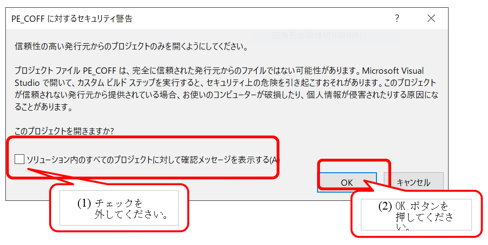

# PE_COFF

独自の再配置情報を付加した独自拡張仕様の 64 ビット WebAssembly を生成し、ランタイム無しで動作する  
PE32+(DLL と UEFI アプリ)を出力する C コンパイラ試作版です。アセンブラ・逆アセンブラ・リンカ・ローダも  
自作しています。出力した UEFI アプリは、実機(GIGABYTE Z590 D (rev. 1.0) + Core i5-11500)で動作しました。

Unicode Character Database(UnicodeData.txt)を内蔵し、ビットベクトル形式の索引を用いてコード・ポイントの  
属性を取得することで、識別子の先頭が数字の場合にエラーにすることを可能にしています。索引のテストも内蔵  
しています。

C 言語で書かれていて、Visual Studio の標準 C ライブラリと Windows API に依存しています。安定版は、  
以下のリポジトリで公開していく予定です。PE_COFF リポジトリは、開発版の位置づけになります。

https://github.com/tenpoku1000/tenpoku

* 処理の大まかな流れ
```
ソースコード(UTF-8) -> プリプロセッサ・トークン -> トークン -> 解析木(具象構文木) ->
  高水準中間言語(tp_compiler_semantic_analysis.h の TP_C_OBJECT 型) ->
      低水準中間言語(独自 64 ビット拡張 WebAssembly + 再配置情報：tp_compiler_wasm.h の TP_WASM_RELOCATION 型など) ->
           PE/COFF -> PE32+ DLL(JIT 実行の場合は、メモリ上で作成した DLL を自作ローダでロード)/UEFI アプリ
```

## ファイルのダウンロード時の注意事項

リリースされたファイルは以下の URL からダウンロードできます。コンパイル済みバイナリには、ソースコードも同梱されます。

https://github.com/tenpoku1000/PE_COFF/releases

コマンドプロンプトで以下のコマンドを投入し、ゾーン情報を削除します。

```
C:\>echo.>PE_COFF-master.zip:Zone.Identifier
```

## 開発環境

* Visual Studio Community 2022

Windows SDK and developer tools - Windows app development  
https://developer.microsoft.com/en-us/windows/downloads/

Visual Studio Older Downloads  
https://visualstudio.microsoft.com/vs/older-downloads/

Download the Windows Driver Kit (WDK) - Windows drivers | Microsoft Docs  
https://docs.microsoft.com/en-us/windows-hardware/drivers/download-the-wdk

* 64 ビット版 Windows 10 / 11

## ビルド方法

* PE_COFF.sln ファイルをダブルクリックします。
* ゾーン情報を削除していない場合は、Visual Studio のセキュリティ警告を回避してプロジェクトを開きます。  


* F7 キーを押下します。

ビルド後に tools フォルダに存在するファイルが、bin フォルダにコピーされます。

## ビルド後に出力される bin フォルダのファイルの説明

```
tenpoku-dev.exe : コンパイラの実行可能ファイルです。
tpc_JIT.cmd : C ソースコードをコンパイルし、JIT 実行します。
tpc_Node.js : WebAssembly を Node.js で実行します。
tpc_Node_JIT.cmd : C ソースコードをコンパイルして JIT 実行し、WebAssembly を Node.js で実行します(ただし実行に失敗します。仕様です。)。
tpc_Node_calc.cmd : 四則演算列ソースコードをコンパイルして JIT 実行し、WebAssembly を Node.js で実行します。
tpc_calc.cmd : 四則演算列ソースコードをコンパイルして JIT 実行します。
tpc_dll.cmd : C ソースコードをコンパイルし、DLL を出力して実行します。
tpc_efi_copy_app.cmd : UEFI アプリ bin\bootx64.efi を bin\efi\boot\bootx64.efi にコピーします。
tpc_exec_name.cmd : 実行可能ファイルのファイル名を設定します。tenpoku-dev.exe が既定です。
tpc_src_C_name.cmd : コンパイル対象の C ソースコードのファイル名を設定します。tps_src.c が既定です。
tpc_test_C.cmd : C コンパイラのテストを実行します。
tpc_test_UCD.cmd : Unicode Character Database(UnicodeData.txt)の索引のテストを実行します。
tpc_test_calc.cmd : 四則演算コンパイラのテストを実行します。
tpc_test_disasm.cmd : x64 機械語の逆アセンブラのテストを実行します。
tpc_wasm64_UEFI.cmd : UEFI アプリが出力されます。
tps_src.c : コンパイル対象の C ソースコード
tps_src.txt : コンパイル対象の四則演算列ソースコード
```

## コンパイラ tenpoku-dev.exe のコマンドライン引数

```
usage: tenpoku-dev [-/][abcdefghijklmnpqrsTtuwxyz] [input file] [test case] [source code string]
  -a : set test of disassembler of x64.
  -b : set output token file.
  -c : set input/output current directory(other than DLL and EFI).
  -d : set output UNICODE CHARACTER DATABASE file.
  -e : set test UNICODE CHARACTER DATABASE.
  -f : set execute of dll.
  -g : set TP_IMAGE_SUBSYSTEM_EFI_APPLICATION to subsystem.
  -h : display of usage message.
  -i : set use int_calc_compiler.
  -j : set output parse tree file.
  -k : set output semantic analysis file.
  -l : set output log file(include -b -j -k -w -x -y -z options).
  -m : set no output messages.
  -n : set no output files.
  -p : set disable test of calc first set and follow set.
  -q : set calc first set and follow set.
  -r : set origin wasm. [input file] is not necessary.
  -s : set source code command line parameter mode.
       need [source code string] up to 255 characters. [input file] is not necessary.
  -T : set [test case] of test mode. [input file] is not necessary.
  -t : set test mode(include -l option). [input file] is not necessary.
  -u : set wchar_t to UTF-32.
  -w : set output wasm file.
  -x : set output x64 file.
  -y : set output wasm text file.
  -z : set output PE/COFF file.
```

## コンパイル可能な C 言語のソースコード例(関数定義・複文・32 ビットまたは 64 ビットの変数・四則演算・関数呼び出し・コメントに対応)

```
int calc_body2(int value1)
{
    return value1 = value1 + 100;
}

int calc_body(int value1, int value2, int value3, int value4)
{
    return calc_body2(value1 = value2 + value3 + value4);
}

int g_value1 = 0;
int g_value3 = 49;

int calc(void)
{
    int value2 = 2 + (3 * g_value1);
    return calc_body(g_value1 = (1 + 2) * 3, value2, g_value3, 51);
}

int/* BOOL */ DllMain(
    long long /* HINSTANCE */, unsigned long/* DWORD */, long long /* LPVOID */)
{
    return 1/* TRUE */;
}
```

## bin フォルダのコマンドの実行方法(JIT 実行や DLL を出力する場合)

上述したように、ゾーン情報を削除しておくことが前提条件です。

* JIT 実行の場合：tpc_JIT.cmd を実行すると、以下のファイルが出力されます。
```
tp_exec_log.log : tpc_JIT.cmd の log ファイル
tp_log.log : tenpoku-dev.exe の log ファイル
tp_object_hash.log : 意味解析のハッシュ表に登録されている内容のファイル(C コンパイラの場合、何も出力されないのが正常動作です)
現時点では、高水準中間言語(tp_compiler_semantic_analysis.h の TP_C_OBJECT 型)はファイル出力されません。
tp_parse_tree.log  : 構文解析で得られた解析木(具象構文木)を記録したファイル
tp_pp_token.log : 字句解析時のプリプロセッサ・トークン列を記録したファイル
tp_token.log : 字句解析時のトークン列を記録したファイル
tps_src.bin : JIT 実行される .text セクションの Raw Data です。
tps_src.wasm : 独自の再配置情報を付加した独自仕様の 64 ビット WebAssembly(現時点では、再配置情報は含まれていません)
tps_src_bin.txt : JIT 実行される .text セクションの機械語を逆アセンブルしたファイルです。
tps_src_wasm.txt : tps_src.wasm の Code セクション内の命令列をテキスト化したファイルです。
```

* DLL を出力し、実行する場合：tpc_dll.cmd を実行すると、以下のファイルが出力されます。
```
calc.dll : PE32+ DLL ファイルです(tps_src.obj を link したものです)。
calc_dll.bin : calc.dll の .text セクションの Raw Data です。
calc_dll.txt : calc.dll の内容をテキスト化したファイルです。
calc_dll_bin.txt : calc_dll.bin の機械語を逆アセンブルしたファイルです。
tp_exec_log.log : tpc_dll.cmd の log ファイルです。
tp_log.log : tenpoku-dev.exe の log ファイルです。
tp_object_hash.log : 意味解析のハッシュ表に登録されている内容のファイル(C コンパイラの場合、何も出力されないのが正常動作です)
現時点では、高水準中間言語(tp_compiler_semantic_analysis.h の TP_C_OBJECT 型)はファイル出力されません。
tp_parse_tree.log  : 構文解析で得られた解析木(具象構文木)を記録したファイル
tp_pp_token.log : 字句解析時のプリプロセッサ・トークン列を記録したファイル
tp_token.log : 字句解析時のトークン列を記録したファイル
tps_src.obj : COFF オブジェクトファイル
tps_src.wasm : 独自の再配置情報を付加した独自仕様の 64 ビット WebAssembly(現時点では、再配置情報は含まれていません)
tps_src_obj.bin : tps_src.obj の .text セクションの Raw Data です。
tps_src_obj.txt : tps_src.obj の内容をテキスト化したファイルです。
tps_src_obj_bin.txt : tps_src_obj.bin の機械語を逆アセンブルしたファイルです。
tps_src_wasm.txt : tps_src.wasm の Code セクション内の命令列をテキスト化したファイルです。
```

## 出力される UEFI アプリに相当する C 言語のソースコード

以下のソースコードはコンパイルされません。このソースコード相当の内容を tp_make_wasm_body_UEFI64.c の  
C 言語の関数で独自拡張の WebAssembly を生成します。今後の機能拡張で、コンパイル可能になる予定です。

[efi_main.c](efi_main.c)

## bin フォルダのコマンドの実行方法(UEFI アプリを出力する場合)

上述したように、ゾーン情報を削除しておくことが前提条件です。

* tpc_wasm64_UEFI.cmd を実行すると、以下のファイルが出力されます。
```
bootx64.efi : UEFI アプリの PE32+ Image ファイルです(efi_main.obj を link したものです)。
bootx64_efi.bin : bootx64.efi の .text セクションの Raw Data です。
bootx64_efi.txt : bootx64.efi の内容をテキスト化したファイルです。
bootx64_efi_bin.txt : bootx64_efi.bin の機械語を逆アセンブルしたファイルです。
efi_main.obj : COFF オブジェクトファイル
efi_main.wasm : 独自の再配置情報を付加した独自仕様の 64 ビット WebAssembly(現時点では、再配置情報は含まれていません)
efi_main_obj.bin : COFF オブジェクトファイル efi_main.obj の .text セクションの Raw Data です。
efi_main_obj.txt : efi_main.obj の内容をテキスト化したファイルです。
efi_main_obj_bin.txt : efi_main_obj.bin の機械語を逆アセンブルしたファイルです。
efi_main_wasm.txt : efi_main.wasm の Code セクション内の命令列をテキスト化したファイルです。
tp_exec_log.log : tpc_wasm64_UEFI.cmd の log ファイル
tp_log.log : tenpoku-dev.exe の log ファイル
```

* 実機での動作確認用：tpc_efi_copy_app.cmd を実行すると、bin\bootx64.efi が以下にコピーされます。
```
bin\efi\boot\bootx64.efi : UEFI アプリ(efi_main.obj を link した結果)
```

## UEFI アプリでの実機での動作確認

* FAT32 でフォーマットした UEFI メモリに efi\boot\bootx64.efi をコピー
* UEFI セットアップ画面で USB メモリからの起動を選択
* UEFI アプリが起動し、メッセージが表示される
* 任意のキーを押下すると PC がリセットされる。これにより、UEFI アプリが正常に動作したことが確認できる

## ライセンス

[混合ライセンス](LICENSE)

## 作者

市川 真一(Shin'ichi Ichikawa) <tenpoku1000@outlook.com>

